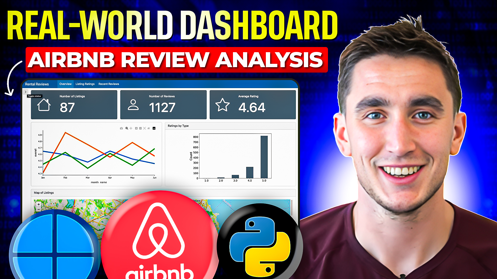

# Building a Real-World Python Dashboard with Quarto: Airbnb Analysis

[▶️ Watch the Full Tutorial on YouTube](https://youtu.be/gCLCn4TVlWo?si=3F03a1A50iMd5pHx)

This hands-on tutorial demonstrates how to build a professional dashboard using Quarto and Python, featuring real Airbnb data analysis. The guide progresses from basic layout principles to advanced interactive features, including Shiny integration.

## Dashboard Components
The tutorial covers the complete development of an analytical dashboard, including:
- Value boxes for key metrics
- Data visualization with Matplotlib
- Interactive maps using Folium
- Multi-page dashboard structure
- Interactive tables with itables
- Shiny component integration

## Technical Implementation
- Setting up basic Quarto dashboard layouts
- Processing and preparing Airbnb data
- Creating various visualization types
    - Line graphs for trend analysis
    - Bar charts for comparison
    - Geographic visualization with Folium
- Implementing interactive elements
- Integrating Shiny functionality

## Advanced Topics
- When to choose Quarto vs. Shiny for dashboards
- Hosting solutions with Posit Connect Cloud
- Multi-page dashboard organization
- Bootstrap icon integration
- Custom styling and layout optimization

This guide is perfect for data professionals looking to create interactive, production-ready dashboards that combine both static and dynamic elements.