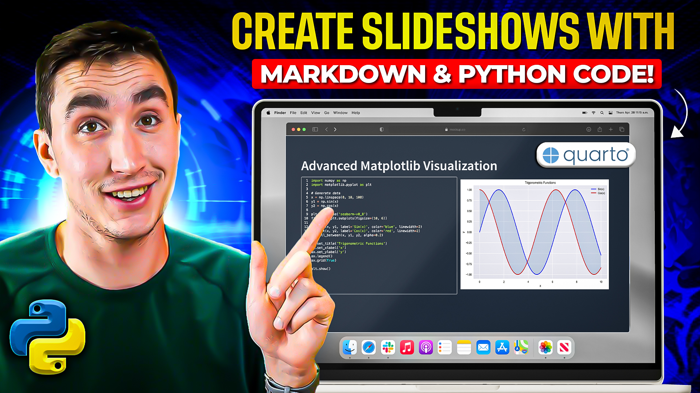

# Creating Interactive Presentations with Quarto, Markdown & Python

[](https://youtu.be/kWnMc0GwX-U?si=t9y2zfJzcsH4KPkP)

[▶️ Watch the Full Tutorial on YouTube](https://youtu.be/kWnMc0GwX-U?si=t9y2zfJzcsH4KPkP)

This comprehensive guide demonstrates how to create engaging technical presentations using Quarto with Python code integration. Learn to build interactive slideshows that combine markdown, code execution, and dynamic visualizations.

<div>
```{=html}
<iframe width="100%" height="475px;" src="example.html"></iframe>
```
</div>

## Presentation Formats
The tutorial covers multiple output formats with a focus on reveal.js capabilities:
- Interactive HTML presentations with reveal.js
- PowerPoint (PPTX) export options
- PDF export functionality

## Core Features
- Code execution and animation
- Syntax highlighting and line emphasis
- Data visualization integration
    - Matplotlib charts
    - Plotly interactive plots
    - Seaborn visualizations
- DataFrame display optimization
- LaTeX equation support
- Incremental content revelation
- Custom slide transitions

## Advanced Functionality
- Interactive presentation controls
- Chalkboard annotations
- Zoom capabilities
- Image positioning and management
- Brand theming with YAML
- Custom styling implementation

## Professional Features
- Unified branding implementation
- Presentation shortcuts and controls
- Multiple output format support
- Advanced animation options
- Theme customization

This guide is ideal for technical presenters who need to combine code, data, and explanatory content in an engaging format.